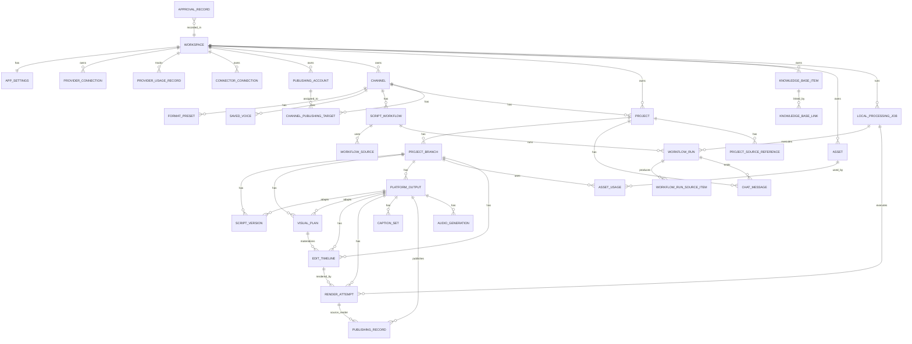
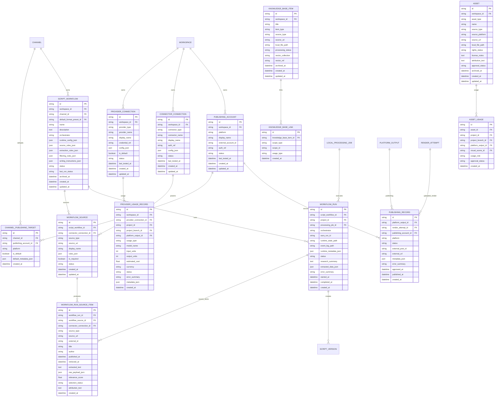

# hyogen.ai ERD & Data Model

> Archived legacy reference. Do not use this file as the current runtime or schema source of truth. The current root docs supersede the Aura-era assumptions here and use a DeepAgents-backed MVP harness.

This document defines the technical data model derived from `HYOGEN_PRD.md`.

The PRD is the product source of truth. This ERD translates the product requirements into entities, relationships, and persistence rules that implementation and design agents can build from.

## 0. Technology Stack and Runtime Decisions

hyogen.ai is modeled as a local-first desktop application with a Rust-heavy runtime:

* **Desktop shell:** Tauri is the canonical application shell. Rust owns persistence, filesystem access, secure credential references, background jobs, render orchestration, and IPC/event emission to the UI.
* **Agent orchestration:** Aura is the canonical agent/workflow runtime. Do not introduce Deep Agents-specific concepts into the schema. Aura run IDs, state snapshots, event logs, and runtime metadata are stored on workflow/job records.
* **Video editing/rendering:** [`Gausian_native_editor`](https://github.com/gausian-AI/Gausian_native_editor) is the canonical native editing/timeline engine. FFmpeg/FFprobe are the canonical media processing, transcoding, muxing, subtitle burn-in, and export tools.
* **Performance posture:** Long-running work is tracked as local processing jobs, runs off the UI thread, emits progress over Tauri events, and stores logs/metrics locally for diagnosis without exposing raw logs by default.

## 1. Canonical Modeling Decisions

### 1.1 Official Project Hierarchy

The canonical production hierarchy is:

`Project → Project Branch → Platform Output → Edit Timeline → Render Attempt → Final Approved Render`

Example:

* Project: “Ferrari race strategy breakdown.”
* Branch: “Dramatic hook version.”
* Platform outputs:
  * YouTube long-form.
  * YouTube Short.
  * TikTok.
  * Instagram Reel.
* Each platform output can have multiple edit timelines as the plan/assets/captions/audio change.
* Each platform output can have multiple render attempts.
* Each platform output can have only one active edit timeline and one final approved render at a time.

### 1.2 Workspace Assumption

MVP assumes one local user and one local workspace, but the schema keeps a `workspace_id` on core records so future multi-workspace support does not require a full migration.

### 1.3 Global Credentials and Multiple Accounts

Provider credentials are global workspace-level records. Users can store multiple connections for the same provider and choose one default per provider.

Publishing accounts are separate from provider credentials. Users can connect multiple accounts per publishing platform and map defaults to channels.

### 1.4 Knowledge Base vs Asset Library

Knowledge base items are reference material used by agents for reasoning, writing, and brand memory.

Assets are media files or references that may appear in the produced video.

They are separate entities.

### 1.5 Approvals Are First-Class Records

Every major user decision should create an `approval_records` row. Status fields are still useful for quick filtering, but approval history must not be stored only as status strings.

### 1.6 Archive, Delete, and Local Files

* Archive hides records from primary views without deleting them.
* Delete removes app records after confirmation.
* Deleting a record that points to a local file must not delete the file unless the user separately confirms local file deletion.

### 1.7 Runtime and Desktop Boundary

Tauri is the app boundary. The frontend should talk to the Rust core through Tauri commands/events, while the Rust core owns local persistence, filesystem access, secure credential references, background workers, render orchestration, and process supervision.

### 1.8 Aura-Orchestrated Workflows

Aura is the canonical orchestration runtime for chat, research, script, planning, and tool-using workflows. The schema should store Aura run identifiers and local state/log paths, but it should not store Deep Agents-specific abstractions.

Provider connections still represent the underlying LLM, TTS, image, embedding, and connector services that Aura can call.

### 1.9 Native Editing and Rendering Boundary

Generated visual plans become native edit timelines before rendering. `Gausian_native_editor` is the canonical timeline/editor engine. FFmpeg/FFprobe are the canonical media processing/export tools.

Render attempts should reference an immutable edit timeline snapshot plus local render artifacts, command logs, and performance metrics so renders are reproducible and diagnosable.

## 2. High-Level ERD

## 3. Production Workflow ERD

```mermaid
erDiagram
    PROJECT {
        string id PK
        string workspace_id FK
        string channel_id FK
        string title
        text description
        string original_prompt
        string status
        string active_branch_id FK
        datetime archived_at
        datetime created_at
        datetime updated_at
    }

    PROJECT_BRANCH {
        string id PK
        string project_id FK
        string parent_branch_id FK
        string name
        text description
        string status
        boolean is_active
        datetime archived_at
        datetime created_at
        datetime updated_at
    }

    SCRIPT_VERSION {
        string id PK
        string project_branch_id FK
        string platform_output_id FK
        int version_number
        text script_text
        string status
        text user_notes
        string source_workflow_run_id FK
        datetime approved_at
        datetime archived_at
        datetime created_at
    }

    VISUAL_PLAN {
        string id PK
        string project_branch_id FK
        string platform_output_id FK
        string script_version_id FK
        int version_number
        string status
        text summary
        datetime approved_at
        datetime archived_at
        datetime created_at
    }

    VISUAL_SCENE {
        string id PK
        string visual_plan_id FK
        int scene_number
        text script_segment
        float start_time_seconds
        float end_time_seconds
        text visual_description
        string required_asset_type
        text on_screen_text
        text caption_notes
        text lower_third_notes
        text transition_notes
        string approval_status
        datetime created_at
    }

    EDIT_TIMELINE {
        string id PK
        string workspace_id FK
        string project_branch_id FK
        string platform_output_id FK
        string visual_plan_id FK
        int version_number
        string status
        string editor_engine
        string engine_project_path
        string timeline_manifest_path
        string ffmpeg_filtergraph_path
        float duration_seconds
        string resolution
        float fps
        json audio_layout_json
        json performance_hints_json
        datetime approved_at
        datetime archived_at
        datetime created_at
        datetime updated_at
    }

    EDIT_TIMELINE_TRACK {
        string id PK
        string edit_timeline_id FK
        string track_type
        int track_index
        string name
        json settings_json
        datetime created_at
        datetime updated_at
    }

    EDIT_TIMELINE_CLIP {
        string id PK
        string edit_timeline_id FK
        string edit_timeline_track_id FK
        string visual_scene_id FK
        string asset_id FK
        string caption_set_id FK
        string clip_type
        float start_time_seconds
        float end_time_seconds
        float source_start_time_seconds
        float source_end_time_seconds
        int layer_index
        text text_payload
        json transform_json
        json effect_json
        json transition_json
        json metadata_json
        datetime created_at
        datetime updated_at
    }

    PLATFORM_OUTPUT {
        string id PK
        string project_branch_id FK
        string format_preset_id FK
        string active_edit_timeline_id FK
        string platform
        string output_type
        string aspect_ratio
        int target_duration_seconds
        json metadata_json
        string caption_behavior
        string status
        string final_render_attempt_id FK
        datetime archived_at
        datetime created_at
        datetime updated_at
    }

    RENDER_ATTEMPT {
        string id PK
        string platform_output_id FK
        string edit_timeline_id FK
        string processing_job_id FK
        int attempt_number
        string status
        string render_engine
        string render_plan_path
        string editor_project_snapshot_path
        string ffmpeg_command_path
        string ffmpeg_version
        string hardware_acceleration
        string output_file_path
        string artifact_manifest_path
        json performance_metrics_json
        string error_summary
        string error_log_path
        boolean is_final
        datetime started_at
        datetime completed_at
        datetime created_at
    }

    LOCAL_PROCESSING_JOB {
        string id PK
        string workspace_id FK
        string project_id FK
        string project_branch_id FK
        string platform_output_id FK
        string target_type
        string target_id
        string job_type
        string runtime
        string status
        float progress_percent
        text current_step
        boolean cancellable
        string command_ref
        string stdout_log_path
        string stderr_log_path
        text error_summary
        json performance_metrics_json
        datetime started_at
        datetime completed_at
        datetime created_at
        datetime updated_at
    }

    PROJECT ||--o{ PROJECT_BRANCH : has
    PROJECT_BRANCH ||--o{ SCRIPT_VERSION : drafts
    PLATFORM_OUTPUT ||--o{ SCRIPT_VERSION : platform_adaptations
    SCRIPT_VERSION ||--o{ VISUAL_PLAN : informs
    PROJECT_BRANCH ||--o{ VISUAL_PLAN : has
    PLATFORM_OUTPUT ||--o{ VISUAL_PLAN : platform_plans
    VISUAL_PLAN ||--o{ VISUAL_SCENE : contains
    VISUAL_PLAN ||--o{ EDIT_TIMELINE : materializes
    PROJECT_BRANCH ||--o{ EDIT_TIMELINE : has
    PLATFORM_OUTPUT ||--o{ EDIT_TIMELINE : has
    EDIT_TIMELINE ||--o{ EDIT_TIMELINE_TRACK : tracks
    EDIT_TIMELINE_TRACK ||--o{ EDIT_TIMELINE_CLIP : clips
    VISUAL_SCENE ||--o{ EDIT_TIMELINE_CLIP : maps_to
    ASSET ||--o{ EDIT_TIMELINE_CLIP : source_media
    CAPTION_SET ||--o{ EDIT_TIMELINE_CLIP : captions
    PROJECT_BRANCH ||--o{ PLATFORM_OUTPUT : produces
    FORMAT_PRESET ||--o{ PLATFORM_OUTPUT : shapes
    PLATFORM_OUTPUT ||--o{ RENDER_ATTEMPT : renders
    EDIT_TIMELINE ||--o{ RENDER_ATTEMPT : rendered_as
    LOCAL_PROCESSING_JOB ||--o{ RENDER_ATTEMPT : executes
```

## 4. Connectors, Knowledge, Assets, and Publishing ERD

## 5. Core Entity Definitions

### 5.1 `workspaces`

Represents the local app environment. MVP has one workspace.

| Field | Type | Notes |
|---|---|---|
| `id` | string | Primary key. UUID. |
| `name` | string | Display name, e.g. `Local Workspace`. |
| `created_at` | datetime | Creation timestamp. |
| `updated_at` | datetime | Last update timestamp. |

### 5.2 `app_settings`

Global app settings for the workspace.

| Field | Type | Notes |
|---|---|---|
| `id` | string | Primary key. UUID or singleton `default`. |
| `workspace_id` | string | FK to `workspaces.id`. Unique. |
| `license_key` | string nullable | License key. |
| `trial_started_at` | datetime nullable | Trial start. |
| `trial_ends_at` | datetime nullable | Trial end. |
| `license_status` | string | `trial`, `active`, `expired`, `invalid`, `unknown`. |
| `music_folder_path` | string nullable | Local music folder. |
| `default_asset_folder_path` | string nullable | Default local asset folder. |
| `ffmpeg_binary_path` | string nullable | Optional user override; app should prefer bundled/managed FFmpeg. |
| `ffprobe_binary_path` | string nullable | Optional user override; app should prefer bundled/managed FFprobe. |
| `gausian_editor_config_json` | JSON | Gausian Native Editor version, capability flags, and runtime config. |
| `aura_runtime_config_json` | JSON | Aura runtime preferences; secrets remain in provider connections/secure storage. |
| `render_preferences_json` | JSON | Hardware acceleration, proxy/cache, concurrency, export quality, and render defaults. |
| `general_preferences_json` | JSON | App-level preferences. |
| `created_at` | datetime | Creation timestamp. |
| `updated_at` | datetime | Last update timestamp. |

### 5.3 `provider_connections`

Stores global AI, TTS, image, and local provider connections.

Aura is the orchestration runtime and should not be modeled as a provider connection. It uses these provider connections when calling LLM, TTS, image, embedding, and local services.

Credentials should be stored securely. `credential_ref` points to secure storage, not raw secret text.

| Field | Type | Notes |
|---|---|---|
| `id` | string | Primary key. UUID. |
| `workspace_id` | string | FK to `workspaces.id`. |
| `provider_type` | string | `llm`, `tts`, `image`, `embedding`, `local`, `other`. |
| `provider_name` | string | `openai`, `anthropic`, `google`, `elevenlabs`, `sarvam`, etc. |
| `display_name` | string | User-visible account/connection name. |
| `credential_ref` | string nullable | Secure credential reference. |
| `config_json` | JSON | Provider-specific settings, model defaults, endpoint URLs. |
| `is_default` | boolean | Default for provider/provider type. |
| `status` | string | `connected`, `needs_auth`, `invalid`, `untested`, `disabled`. |
| `last_tested_at` | datetime nullable | Last connection test timestamp. |
| `created_at` | datetime | Creation timestamp. |
| `updated_at` | datetime | Last update timestamp. |

### 5.4 `provider_usage_records`

Tracks usage, limits, cost estimates, and provider errors for BYOK and limited provider operations.

This supports LLM token tracking, TTS character usage, image generation limits, embedding costs, and future usage dashboards.

| Field | Type | Notes |
|---|---|---|
| `id` | string | Primary key. UUID. |
| `workspace_id` | string | FK to `workspaces.id`. |
| `provider_connection_id` | string nullable | FK to `provider_connections.id`. |
| `project_id` | string nullable | FK to `projects.id`. |
| `project_branch_id` | string nullable | FK to `project_branches.id`. |
| `platform_output_id` | string nullable | FK to `platform_outputs.id`. |
| `usage_type` | string | `llm_tokens`, `tts_characters`, `image_generation`, `embedding`, `connector_api`, `other`. |
| `model_name` | string nullable | Provider/model used. |
| `input_units` | integer nullable | Input tokens, characters, images, or calls depending on usage type. |
| `output_units` | integer nullable | Output tokens, characters, images, or calls depending on usage type. |
| `estimated_cost` | decimal nullable | Estimated cost when available. |
| `currency` | string nullable | Currency for cost estimate. |
| `status` | string | `success`, `failed`, `cancelled`, `estimated`. |
| `error_summary` | text nullable | Clean provider error summary, if failed. |
| `metadata_json` | JSON | Raw usage metadata from provider, sanitized of secrets. |
| `created_at` | datetime | Creation timestamp. |

### 5.5 `local_processing_jobs`

Tracks Rust-side background work invoked from Tauri commands, Aura workflows, Gausian Native Editor operations, FFmpeg/FFprobe processes, indexing, and connector tasks.

This is a local job table, not a cloud queue. It exists so the UI can show progress, cancellation, retry state, and diagnostics without blocking the desktop app.

| Field | Type | Notes |
|---|---|---|
| `id` | string | Primary key. UUID. |
| `workspace_id` | string | FK to `workspaces.id`. |
| `project_id` | string nullable | FK to `projects.id`, if job is project-scoped. |
| `project_branch_id` | string nullable | FK to `project_branches.id`, if branch-scoped. |
| `platform_output_id` | string nullable | FK to `platform_outputs.id`, if output-scoped. |
| `target_type` | string nullable | `workflow_run`, `edit_timeline`, `render_attempt`, `asset`, `knowledge_base_item`, `publishing_record`, etc. |
| `target_id` | string nullable | Target record ID. Enforced by app logic. |
| `job_type` | string | `aura_workflow`, `asset_probe`, `indexing`, `transcode`, `timeline_build`, `render`, `publish`, `cleanup`, `other`. |
| `runtime` | string | `rust`, `aura`, `gausian_native_editor`, `ffmpeg`, `ffprobe`, `tauri_command`, `other`. |
| `status` | string | `queued`, `running`, `succeeded`, `failed`, `cancelled`. |
| `progress_percent` | decimal nullable | 0–100 progress estimate when known. |
| `current_step` | text nullable | Human-readable current step for progress UI. |
| `cancellable` | boolean | Whether the user can cancel the job. |
| `command_ref` | string nullable | Local command/script/process reference; never store secrets. |
| `stdout_log_path` | string nullable | Local stdout/general log path. |
| `stderr_log_path` | string nullable | Local stderr/error log path. |
| `error_summary` | text nullable | Clean failure summary for UI. |
| `performance_metrics_json` | JSON | Runtime duration, CPU/GPU hints, memory, encode speed, cache hits, etc. |
| `started_at` | datetime nullable | Start timestamp. |
| `completed_at` | datetime nullable | Completion timestamp. |
| `created_at` | datetime | Creation timestamp. |
| `updated_at` | datetime | Last update timestamp. |

### 5.6 `connector_connections`

Stores source/research/storage connector connections.

Examples: YouTube, Reddit, Twitter/X, Notion, Google Drive, local folders, URLs/web, RSS, future MCP connectors.

| Field | Type | Notes |
|---|---|---|
| `id` | string | Primary key. UUID. |
| `workspace_id` | string | FK to `workspaces.id`. |
| `connector_type` | string | `source`, `storage`, `asset_source`, `mcp`, `local`, `web`. |
| `connector_name` | string | `youtube`, `reddit`, `twitter_x`, `notion`, `google_drive`, `rss`, etc. |
| `display_name` | string | User-visible connection name. |
| `auth_ref` | string nullable | Secure auth reference when needed. |
| `config_json` | JSON | Connector-specific settings. |
| `status` | string | `connected`, `needs_auth`, `invalid`, `untested`, `disabled`. |
| `last_tested_at` | datetime nullable | Last connection test timestamp. |
| `created_at` | datetime | Creation timestamp. |
| `updated_at` | datetime | Last update timestamp. |

### 5.7 `publishing_accounts`

Connected accounts used for uploading final outputs.

Users can connect multiple accounts per platform.

| Field | Type | Notes |
|---|---|---|
| `id` | string | Primary key. UUID. |
| `workspace_id` | string | FK to `workspaces.id`. |
| `platform` | string | `youtube`, `tiktok`, `instagram`. |
| `display_name` | string | User-visible account name. |
| `external_account_id` | string nullable | Platform account/channel identifier. |
| `auth_ref` | string nullable | Secure OAuth/token reference. |
| `status` | string | `connected`, `needs_auth`, `invalid`, `untested`, `disabled`. |
| `last_tested_at` | datetime nullable | Last connection test timestamp. |
| `created_at` | datetime | Creation timestamp. |
| `updated_at` | datetime | Last update timestamp. |

## 6. Channel, Format, Voice, and Workflow Entities

### 6.1 `channels`

Represents a brand, creator identity, client, or publishing presence.

| Field | Type | Notes |
|---|---|---|
| `id` | string | Primary key. UUID. |
| `workspace_id` | string | FK to `workspaces.id`. |
| `name` | string | Channel name. |
| `description` | text nullable | Channel description. |
| `logo_asset_id` | string nullable | FK to `assets.id`. |
| `brand_colors_json` | JSON | Brand colors. |
| `font_preferences_json` | JSON | Font preferences. |
| `visual_style_notes` | text nullable | Visual style guidance. |
| `tone_of_voice` | text nullable | Writing/voice guidance. |
| `target_audience` | text nullable | Audience description. |
| `do_rules_json` | JSON | Things to do. |
| `dont_rules_json` | JSON | Things to avoid. |
| `content_pillars_json` | JSON | Default topics/pillars. |
| `source_preferences_json` | JSON | Preferred/blocked sources. |
| `default_caption_style_json` | JSON | Default caption styling. |
| `default_music_preferences_json` | JSON | Default music preferences. |
| `status` | string | `active`, `archived`. |
| `archived_at` | datetime nullable | Archive timestamp. |
| `created_at` | datetime | Creation timestamp. |
| `updated_at` | datetime | Last update timestamp. |

### 6.2 `format_presets`

Defines a reusable format such as Short-form vertical, Long-form horizontal, Square/social feed, or Custom.

Global defaults have `channel_id = null`. Channel-customized presets have a `channel_id` and may reference `base_format_preset_id`.

| Field | Type | Notes |
|---|---|---|
| `id` | string | Primary key. UUID. |
| `workspace_id` | string | FK to `workspaces.id`. |
| `channel_id` | string nullable | FK to `channels.id`; null for global defaults. |
| `base_format_preset_id` | string nullable | FK to source preset if copied/customized. |
| `name` | string | Preset name. |
| `format_type` | string | `short_vertical`, `long_horizontal`, `square_feed`, `custom`. |
| `intended_platforms_json` | JSON | Platforms supported by preset. |
| `target_duration_seconds` | integer nullable | Target duration. |
| `aspect_ratio` | string | `9:16`, `16:9`, `1:1`, `4:5`, etc. |
| `resolution` | string nullable | Export resolution. |
| `pacing` | string nullable | Pacing description. |
| `hook_style` | text nullable | Hook guidance. |
| `script_structure_json` | JSON | Script sections/structure. |
| `caption_behavior` | string | `separate_file`, `burned_in`, `both`, `none`. Captions are generated even if not burned in. |
| `caption_style_json` | JSON | Caption style. |
| `default_voice_id` | string nullable | FK to `saved_voices.id`. |
| `music_preference_json` | JSON | Music preference. |
| `intro_outro_rules_json` | JSON | Intro/outro rules. |
| `visual_density` | string nullable | Visual pacing/density. |
| `cta_rules_json` | JSON | CTA rules. |
| `publishing_metadata_defaults_json` | JSON | Title/description/hashtag defaults. |
| `status` | string | `active`, `archived`. |
| `created_at` | datetime | Creation timestamp. |
| `updated_at` | datetime | Last update timestamp. |

### 6.3 `saved_voices`

Reusable voice choices, usually attached to a channel.

| Field | Type | Notes |
|---|---|---|
| `id` | string | Primary key. UUID. |
| `workspace_id` | string | FK to `workspaces.id`. |
| `channel_id` | string nullable | FK to `channels.id`. |
| `provider_connection_id` | string nullable | FK to `provider_connections.id`. |
| `display_name` | string | Voice name in UI. |
| `provider_voice_id` | string nullable | Provider-specific voice ID. |
| `voice_settings_json` | JSON | Speed, stability, accent, language, etc. |
| `sample_asset_id` | string nullable | FK to `assets.id` for preview/sample. |
| `status` | string | `active`, `archived`. |
| `created_at` | datetime | Creation timestamp. |
| `updated_at` | datetime | Last update timestamp. |

### 6.4 `channel_publishing_targets`

Maps channels to default connected publishing accounts.

| Field | Type | Notes |
|---|---|---|
| `id` | string | Primary key. UUID. |
| `channel_id` | string | FK to `channels.id`. |
| `publishing_account_id` | string | FK to `publishing_accounts.id`. |
| `platform` | string | Denormalized platform for quick filtering. |
| `is_default` | boolean | Default account for the channel/platform. |
| `default_metadata_json` | JSON | Optional account-specific defaults. |
| `created_at` | datetime | Creation timestamp. |

### 6.5 `script_workflows`

Reusable manually-triggered Aura research and writing workflows.

| Field | Type | Notes |
|---|---|---|
| `id` | string | Primary key. UUID. |
| `workspace_id` | string | FK to `workspaces.id`. |
| `channel_id` | string | FK to `channels.id`. |
| `default_format_preset_id` | string nullable | FK to `format_presets.id`. |
| `name` | string | Workflow name. |
| `description` | text nullable | Workflow description. |
| `orchestrator` | string | Canonical value: `aura`. |
| `runtime_config_json` | JSON | Aura graph/tool policy/runtime configuration; no Deep Agents-specific state. |
| `source_rules_json` | JSON | Source selection rules. |
| `extraction_rules_json` | JSON | What to extract. |
| `filtering_rules_json` | JSON | Relevance/trust/freshness filters. |
| `writing_instructions_json` | JSON | Writing instructions. |
| `approval_requirements_json` | JSON | Approval policy for workflow outputs. |
| `status` | string | `active`, `archived`, `disabled`. |
| `last_run_status` | string nullable | Last run status. |
| `archived_at` | datetime nullable | Archive timestamp. |
| `created_at` | datetime | Creation timestamp. |
| `updated_at` | datetime | Last update timestamp. |

### 6.6 `workflow_sources`

Explicit source configuration for a reusable script workflow.

Workflow-level JSON rules still exist for broad instructions, but concrete sources should be modeled here so the UI can show and manage each source independently.

Examples:

* A Reddit community.
* A Twitter/X account or search query.
* A Notion page/database.
* A Google Drive folder.
* An RSS feed.
* A URL or web page.
* A local folder.

| Field | Type | Notes |
|---|---|---|
| `id` | string | Primary key. UUID. |
| `script_workflow_id` | string | FK to `script_workflows.id`. |
| `connector_connection_id` | string nullable | FK to `connector_connections.id`; nullable for plain URLs/local paths. |
| `source_type` | string | `reddit`, `twitter_x`, `youtube`, `notion`, `google_drive`, `rss`, `url`, `local_file`, `local_folder`, `mcp`. |
| `source_uri` | string nullable | URL, folder path, external ID, subreddit name, feed URL, etc. |
| `display_name` | string | User-visible source label. |
| `rules_json` | JSON | Source-specific extraction/filtering rules. |
| `is_required` | boolean | If true, workflow should warn/fail when source cannot be read. |
| `status` | string | `active`, `disabled`, `archived`, `invalid`. |
| `created_at` | datetime | Creation timestamp. |
| `updated_at` | datetime | Last update timestamp. |

### 6.7 `workflow_runs`

A manually-triggered Aura execution of a script workflow.

| Field | Type | Notes |
|---|---|---|
| `id` | string | Primary key. UUID. |
| `script_workflow_id` | string | FK to `script_workflows.id`. |
| `project_id` | string nullable | FK to `projects.id`, if run created/updated a project. |
| `processing_job_id` | string nullable | FK to `local_processing_jobs.id` for the Rust-side local job. |
| `orchestrator` | string | Canonical value: `aura`. |
| `aura_run_id` | string nullable | Runtime run identifier from Aura. |
| `runtime_state_path` | string nullable | Local path to serialized Aura state/checkpoint data. |
| `event_log_path` | string nullable | Local structured event log path for replay/diagnosis. |
| `runtime_metadata_json` | JSON | Aura runtime metadata, tool-call summaries, and sanitized execution context. |
| `status` | string | `running`, `research_ready`, `script_ready`, `failed`, `cancelled`, `complete`. |
| `research_summary` | text nullable | Human-readable research summary. |
| `extracted_data_json` | JSON | Structured extracted data summary; individual items belong in `workflow_run_source_items`. |
| `error_summary` | text nullable | Clean failure summary. |
| `started_at` | datetime nullable | Start time. |
| `completed_at` | datetime nullable | Completion time. |
| `created_at` | datetime | Creation timestamp. |

### 6.8 `workflow_run_source_items`

Individual source items collected during a workflow run.

This allows design agents to build reviewable research cards and lets ERD/implementation agents avoid hiding all source data inside a single JSON blob.

Examples:

* One Reddit post.
* One tweet/thread.
* One YouTube video.
* One RSS article.
* One Notion page.
* One Drive document.
* One web page.

| Field | Type | Notes |
|---|---|---|
| `id` | string | Primary key. UUID. |
| `workflow_run_id` | string | FK to `workflow_runs.id`. |
| `workflow_source_id` | string nullable | FK to `workflow_sources.id`. |
| `connector_connection_id` | string nullable | FK to `connector_connections.id`. |
| `source_type` | string | `reddit`, `twitter_x`, `youtube`, `notion`, `google_drive`, `rss`, `url`, `local_file`, `manual`, etc. |
| `source_url` | string nullable | Source URL or deep link. |
| `external_id` | string nullable | Provider-specific source ID. |
| `title` | string nullable | Source title. |
| `author` | string nullable | Author/channel/account. |
| `published_at` | datetime nullable | Source publish timestamp, if known. |
| `retrieved_at` | datetime nullable | Retrieval timestamp. |
| `extracted_text` | text nullable | Extracted text/content summary. |
| `raw_payload_json` | JSON | Sanitized connector payload when useful. |
| `relevance_score` | float nullable | Aura/system ranking. |
| `selection_status` | string | `candidate`, `selected`, `rejected`, `used`, `ignored`. |
| `attribution_text` | text nullable | Credit/citation text. |
| `created_at` | datetime | Creation timestamp. |

## 7. Project and Production Entities

### 7.1 `projects`

A content idea or production effort under a channel.

| Field | Type | Notes |
|---|---|---|
| `id` | string | Primary key. UUID. |
| `workspace_id` | string | FK to `workspaces.id`. |
| `channel_id` | string | FK to `channels.id`. |
| `title` | string | Project title. |
| `description` | text nullable | Project description. |
| `original_prompt` | text nullable | Initial user prompt/brief. |
| `status` | string | See status enum below. |
| `active_branch_id` | string nullable | FK to `project_branches.id`. |
| `archived_at` | datetime nullable | Archive timestamp. |
| `created_at` | datetime | Creation timestamp. |
| `updated_at` | datetime | Last update timestamp. |

Project status values:

* `draft`
* `researching`
* `script_ready_for_review`
* `visual_plan_ready_for_review`
* `assets_ready_for_review`
* `audio_ready_for_review`
* `ready_to_render`
* `rendering`
* `rendered`
* `publishing`
* `published`
* `failed`
* `archived`

### 7.2 `project_branches`

A creative variation of a project.

| Field | Type | Notes |
|---|---|---|
| `id` | string | Primary key. UUID. |
| `project_id` | string | FK to `projects.id`. |
| `parent_branch_id` | string nullable | FK to `project_branches.id` for branch lineage. |
| `name` | string | User-friendly branch name. |
| `description` | text nullable | Why this branch exists. |
| `status` | string | `active`, `archived`, `deleted`. |
| `is_active` | boolean | Active branch in UI. |
| `archived_at` | datetime nullable | Archive timestamp. |
| `created_at` | datetime | Creation timestamp. |
| `updated_at` | datetime | Last update timestamp. |

### 7.3 `chat_messages`

Persisted project conversation.

| Field | Type | Notes |
|---|---|---|
| `id` | string | Primary key. UUID. |
| `project_id` | string | FK to `projects.id`. |
| `project_branch_id` | string nullable | FK to `project_branches.id`. |
| `workflow_run_id` | string nullable | FK to `workflow_runs.id`, if message was emitted by Aura. |
| `runtime_event_id` | string nullable | Aura event/node/tool-call identifier for traceability. |
| `agent_name` | string nullable | Aura agent/node/tool name when applicable. |
| `role` | string | `user`, `assistant`, `system`, `tool`. |
| `message_type` | string | `text`, `script_card`, `visual_plan_card`, `approval_card`, `error`, etc. |
| `content_text` | text nullable | Message text. |
| `payload_json` | JSON | Structured card/tool payload. |
| `created_at` | datetime | Creation timestamp. |

### 7.4 `script_versions`

Concrete script draft/version, stored separately from chat messages.

| Field | Type | Notes |
|---|---|---|
| `id` | string | Primary key. UUID. |
| `project_branch_id` | string | FK to `project_branches.id`. |
| `platform_output_id` | string nullable | FK to `platform_outputs.id` for platform-specific script adaptations; null for branch/master script. |
| `source_workflow_run_id` | string nullable | FK to `workflow_runs.id`. |
| `version_number` | integer | Sequential per branch/platform scope. |
| `script_text` | text | Script content. |
| `status` | string | `draft`, `needs_revision`, `approved`, `rejected`, `archived`. |
| `user_notes` | text nullable | Revision notes/instructions. |
| `approved_at` | datetime nullable | Approval timestamp. |
| `archived_at` | datetime nullable | Archive timestamp. |
| `created_at` | datetime | Creation timestamp. |

### 7.5 `visual_plans`

Scene-by-scene production plan for an approved script.

| Field | Type | Notes |
|---|---|---|
| `id` | string | Primary key. UUID. |
| `project_branch_id` | string | FK to `project_branches.id`. |
| `platform_output_id` | string nullable | FK to `platform_outputs.id` for platform-specific plans; null for branch/master plan. |
| `script_version_id` | string | FK to `script_versions.id`. |
| `version_number` | integer | Sequential per branch/script/platform scope. |
| `status` | string | `draft`, `needs_revision`, `approved`, `rejected`, `archived`. |
| `summary` | text nullable | Human-readable summary. |
| `approved_at` | datetime nullable | Approval timestamp. |
| `archived_at` | datetime nullable | Archive timestamp. |
| `created_at` | datetime | Creation timestamp. |

### 7.6 `visual_scenes`

Individual scene in a visual plan.

| Field | Type | Notes |
|---|---|---|
| `id` | string | Primary key. UUID. |
| `visual_plan_id` | string | FK to `visual_plans.id`. |
| `scene_number` | integer | Ordered scene number. |
| `script_segment` | text | Related script segment. |
| `start_time_seconds` | float nullable | Estimated start time. |
| `end_time_seconds` | float nullable | Estimated end time. |
| `visual_description` | text | Scene visual description. |
| `required_asset_type` | string nullable | `video`, `image`, `generated_image`, `logo`, etc. |
| `on_screen_text` | text nullable | Text shown on screen. |
| `caption_notes` | text nullable | Caption guidance. |
| `lower_third_notes` | text nullable | Lower-third guidance. |
| `transition_notes` | text nullable | Transition guidance. |
| `approval_status` | string | `pending`, `approved`, `rejected`, `needs_changes`. |
| `created_at` | datetime | Creation timestamp. |

### 7.7 `edit_timelines`

A generated timeline/edit manifest for a platform output.

This is not the primary manual UI surface. It is the native editing artifact produced from approved scripts, visual plans, selected assets, captions, and audio. The canonical editor engine is `gausian_native_editor`; FFmpeg-specific filtergraphs/commands may be generated from this timeline for render attempts.

| Field | Type | Notes |
|---|---|---|
| `id` | string | Primary key. UUID. |
| `workspace_id` | string | FK to `workspaces.id`. |
| `project_branch_id` | string | FK to `project_branches.id`. |
| `platform_output_id` | string | FK to `platform_outputs.id`. |
| `visual_plan_id` | string nullable | FK to `visual_plans.id`, if generated from a visual plan. |
| `version_number` | integer | Sequential per platform output. |
| `status` | string | `draft`, `ready_for_review`, `approved`, `rendering`, `rendered`, `failed`, `archived`. |
| `editor_engine` | string | Canonical value: `gausian_native_editor`. |
| `engine_project_path` | string nullable | Local Gausian Native Editor project/session path. |
| `timeline_manifest_path` | string nullable | Local canonical timeline JSON manifest path consumed by Rust/Gausian/FFmpeg. |
| `ffmpeg_filtergraph_path` | string nullable | Generated FFmpeg filtergraph path when used. |
| `duration_seconds` | float nullable | Timeline duration. |
| `resolution` | string nullable | Render target resolution, e.g. `1920x1080`. |
| `fps` | float nullable | Target frame rate. |
| `audio_layout_json` | JSON | Audio tracks, mix levels, ducking, and channel layout. |
| `performance_hints_json` | JSON | Proxy usage, pre-render hints, cache keys, hardware acceleration preferences. |
| `approved_at` | datetime nullable | Approval timestamp. |
| `archived_at` | datetime nullable | Archive timestamp. |
| `created_at` | datetime | Creation timestamp. |
| `updated_at` | datetime | Last update timestamp. |

### 7.8 `edit_timeline_tracks`

Tracks inside an edit timeline. These model native timeline structure without making a traditional timeline editor the main UX.

| Field | Type | Notes |
|---|---|---|
| `id` | string | Primary key. UUID. |
| `edit_timeline_id` | string | FK to `edit_timelines.id`. |
| `track_type` | string | `video`, `audio`, `caption`, `overlay`, `effect`, `other`. |
| `track_index` | integer | Ordering within the timeline. |
| `name` | string nullable | Optional display/debug name. |
| `settings_json` | JSON | Track-level settings such as mute/solo, blend, mix, or render hints. |
| `created_at` | datetime | Creation timestamp. |
| `updated_at` | datetime | Last update timestamp. |

### 7.9 `edit_timeline_clips`

Clips, overlays, captions, transitions, and generated media placements inside an edit timeline.

| Field | Type | Notes |
|---|---|---|
| `id` | string | Primary key. UUID. |
| `edit_timeline_id` | string | FK to `edit_timelines.id`. |
| `edit_timeline_track_id` | string nullable | FK to `edit_timeline_tracks.id`. |
| `visual_scene_id` | string nullable | FK to `visual_scenes.id`, if clip maps to a planned scene. |
| `asset_id` | string nullable | FK to `assets.id`, if backed by a media asset. |
| `caption_set_id` | string nullable | FK to `caption_sets.id`, if backed by captions. |
| `clip_type` | string | `video`, `image`, `generated_image`, `audio`, `caption`, `text`, `effect`, `transition`, `color`, `nested`. |
| `start_time_seconds` | float | Timeline start. |
| `end_time_seconds` | float | Timeline end. |
| `source_start_time_seconds` | float nullable | Source media in-point. |
| `source_end_time_seconds` | float nullable | Source media out-point. |
| `layer_index` | integer nullable | Layer/z-order within track or scene. |
| `text_payload` | text nullable | Text/caption payload when not stored elsewhere. |
| `transform_json` | JSON | Position, scale, crop, rotation, stabilization, and fit rules. |
| `effect_json` | JSON | Effects, filters, color, speed, and animation settings. |
| `transition_json` | JSON | Transition settings in/out of the clip. |
| `metadata_json` | JSON | Engine-specific metadata; sanitized and portable where possible. |
| `created_at` | datetime | Creation timestamp. |
| `updated_at` | datetime | Last update timestamp. |

### 7.10 `platform_outputs`

A deliverable tailored to a platform or format.

| Field | Type | Notes |
|---|---|---|
| `id` | string | Primary key. UUID. |
| `project_branch_id` | string | FK to `project_branches.id`. |
| `format_preset_id` | string nullable | FK to `format_presets.id`. |
| `active_edit_timeline_id` | string nullable | FK to the current approved/active `edit_timelines.id` for this output. |
| `platform` | string | `youtube`, `youtube_short`, `tiktok`, `instagram`, `local_export`, etc. |
| `output_type` | string | `long_form`, `short`, `reel`, `feed`, `custom`. |
| `aspect_ratio` | string | `9:16`, `16:9`, `1:1`, `4:5`. |
| `target_duration_seconds` | integer nullable | Target duration. |
| `metadata_json` | JSON | Title, description, hashtags, attribution, platform-specific options. |
| `caption_behavior` | string | `separate_file`, `burned_in`, `both`. |
| `status` | string | `draft`, `ready_to_render`, `rendering`, `rendered`, `final_approved`, `publishing`, `published`, `failed`, `archived`. |
| `final_render_attempt_id` | string nullable | FK to `render_attempts.id`. Only one final per output. |
| `archived_at` | datetime nullable | Archive timestamp. |
| `created_at` | datetime | Creation timestamp. |
| `updated_at` | datetime | Last update timestamp. |

### 7.11 `render_attempts`

A local render run for a platform output.

Each render attempt consumes an immutable edit timeline snapshot and is executed by the Rust core through Gausian Native Editor plus FFmpeg/FFprobe where appropriate.

| Field | Type | Notes |
|---|---|---|
| `id` | string | Primary key. UUID. |
| `platform_output_id` | string | FK to `platform_outputs.id`. |
| `edit_timeline_id` | string | FK to `edit_timelines.id`. |
| `processing_job_id` | string nullable | FK to `local_processing_jobs.id` for the render worker. |
| `attempt_number` | integer | Sequential per platform output. |
| `status` | string | `queued`, `rendering`, `complete`, `failed`, `cancelled`. |
| `render_engine` | string | `gausian_native_editor_ffmpeg` by default; `ffmpeg` fallback for simple renders. |
| `render_plan_path` | string nullable | Local render plan JSON path. |
| `editor_project_snapshot_path` | string nullable | Immutable Gausian Native Editor project snapshot used for this render. |
| `ffmpeg_command_path` | string nullable | Local file containing generated FFmpeg command/script. |
| `ffmpeg_version` | string nullable | FFmpeg version used for this attempt. |
| `hardware_acceleration` | string nullable | `videotoolbox`, `none`, or another supported accelerator. |
| `output_file_path` | string nullable | Local video path. |
| `artifact_manifest_path` | string nullable | Local JSON manifest of render outputs, thumbnails, captions, and sidecars. |
| `performance_metrics_json` | JSON | Render duration, encode speed, CPU/GPU hints, memory, cache/proxy stats. |
| `error_summary` | text nullable | Clean error summary for UI. |
| `error_log_path` | string nullable | Local technical log path, not shown raw by default. |
| `is_final` | boolean | True if currently final for the platform output. |
| `started_at` | datetime nullable | Start timestamp. |
| `completed_at` | datetime nullable | Completion timestamp. |
| `created_at` | datetime | Creation timestamp. |

### 7.12 `caption_sets`

Generated captions/subtitles for a platform output.

| Field | Type | Notes |
|---|---|---|
| `id` | string | Primary key. UUID. |
| `platform_output_id` | string | FK to `platform_outputs.id`. |
| `language` | string | Caption language. |
| `caption_text` | text nullable | Caption content if stored inline. |
| `caption_file_path` | string nullable | Local SRT/VTT/etc. path. |
| `style_json` | JSON | Burned-in caption style. |
| `behavior` | string | `separate_file`, `burned_in`, `both`. |
| `status` | string | `draft`, `approved`, `needs_revision`, `archived`. |
| `created_at` | datetime | Creation timestamp. |
| `updated_at` | datetime | Last update timestamp. |

### 7.13 `audio_generations`

Generated or selected voiceover/audio for a platform output.

| Field | Type | Notes |
|---|---|---|
| `id` | string | Primary key. UUID. |
| `platform_output_id` | string | FK to `platform_outputs.id`. |
| `script_version_id` | string nullable | FK to `script_versions.id`. |
| `saved_voice_id` | string nullable | FK to `saved_voices.id`. |
| `provider_connection_id` | string nullable | FK to `provider_connections.id`. |
| `audio_asset_id` | string nullable | FK to `assets.id`. |
| `generation_type` | string | `voiceover`, `music`, `sound_effect`. |
| `status` | string | `pending`, `generating`, `ready_for_review`, `approved`, `failed`, `archived`. |
| `preview_file_path` | string nullable | Preview audio path. |
| `error_summary` | text nullable | Clean failure summary. |
| `created_at` | datetime | Creation timestamp. |
| `updated_at` | datetime | Last update timestamp. |

## 8. Knowledge, Asset, and Source Entities

### 8.1 `knowledge_base_items`

Reference material used by agents for reasoning, writing, and brand memory.

| Field | Type | Notes |
|---|---|---|
| `id` | string | Primary key. UUID. |
| `workspace_id` | string | FK to `workspaces.id`. |
| `title` | string | Display title. |
| `item_type` | string | `pdf`, `docx`, `txt`, `markdown`, `csv`, `image_text`, `url`, `external_source`. |
| `source_type` | string | `upload`, `local_file`, `url`, `notion`, `google_drive`, etc. |
| `source_uri` | string nullable | URL/external identifier. |
| `local_file_path` | string nullable | Local file path. |
| `processing_status` | string | `pending`, `processing`, `ready`, `failed`, `archived`. |
| `vector_collection` | string nullable | LanceDB collection/table. |
| `vector_ref` | string nullable | Vector ID/reference. |
| `archived_at` | datetime nullable | Archive timestamp. |
| `created_at` | datetime | Creation timestamp. |
| `updated_at` | datetime | Last update timestamp. |

### 8.2 `knowledge_base_links`

Many-to-many polymorphic link between knowledge base items and scopes.

| Field | Type | Notes |
|---|---|---|
| `id` | string | Primary key. UUID. |
| `knowledge_base_item_id` | string | FK to `knowledge_base_items.id`. |
| `scope_type` | string | `channel`, `project`, `project_branch`, `script_workflow`. |
| `scope_id` | string | ID of scoped record. Enforced by app logic. |
| `usage_type` | string | `brand_memory`, `project_research`, `workflow_source`, `style_reference`. |
| `created_at` | datetime | Creation timestamp. |

### 8.3 `assets`

Media that may appear in a final video or support production.

| Field | Type | Notes |
|---|---|---|
| `id` | string | Primary key. UUID. |
| `workspace_id` | string | FK to `workspaces.id`. |
| `asset_type` | string | `video`, `image`, `generated_image`, `audio`, `music`, `logo`, `caption`, `other`. |
| `name` | string | Display name. |
| `source_type` | string | `local_file`, `local_folder`, `youtube`, `reddit`, `url`, `free_media`, `image_generation`, `generated_audio`. |
| `source_platform` | string nullable | Platform/source name. |
| `source_url` | string nullable | Original URL. |
| `local_file_path` | string nullable | Local path if downloaded/generated/selected. |
| `rights_status` | string | `unknown`, `user_provided`, `free_to_use`, `licensed`, `needs_review`. |
| `license_notes` | text nullable | Rights/license notes. |
| `attribution_text` | text nullable | Credits for description/end credits. |
| `approval_status` | string | `pending`, `approved`, `rejected`, `needs_changes`. |
| `metadata_json` | JSON | Duration, dimensions, thumbnail, provider metadata, etc. |
| `archived_at` | datetime nullable | Archive timestamp. |
| `created_at` | datetime | Creation timestamp. |
| `updated_at` | datetime | Last update timestamp. |

### 8.4 `asset_usages`

Links assets to projects, branches, platform outputs, and scenes.

| Field | Type | Notes |
|---|---|---|
| `id` | string | Primary key. UUID. |
| `asset_id` | string | FK to `assets.id`. |
| `project_id` | string nullable | FK to `projects.id`. |
| `project_branch_id` | string nullable | FK to `project_branches.id`. |
| `platform_output_id` | string nullable | FK to `platform_outputs.id`. |
| `visual_scene_id` | string nullable | FK to `visual_scenes.id`. |
| `usage_role` | string | `candidate`, `selected`, `rejected`, `background_music`, `voiceover`, `caption`, `logo`, `thumbnail`. |
| `approval_status` | string | `pending`, `approved`, `rejected`, `needs_changes`. |
| `created_at` | datetime | Creation timestamp. |

### 8.5 `image_generation_requests`

Tracks proposed and approved image generations.

| Field | Type | Notes |
|---|---|---|
| `id` | string | Primary key. UUID. |
| `project_branch_id` | string | FK to `project_branches.id`. |
| `visual_scene_id` | string nullable | FK to `visual_scenes.id`. |
| `provider_connection_id` | string nullable | FK to `provider_connections.id`. |
| `prompt` | text | Proposed generation prompt. |
| `reason` | text nullable | Why this image is needed. |
| `estimated_cost_json` | JSON | Usage/cost estimate if available. |
| `status` | string | `proposed`, `approved`, `generating`, `complete`, `rejected`, `failed`. |
| `generated_asset_id` | string nullable | FK to `assets.id`. |
| `error_summary` | text nullable | Clean failure summary. |
| `created_at` | datetime | Creation timestamp. |
| `updated_at` | datetime | Last update timestamp. |

### 8.6 `project_source_references`

Tracks sources, citations, claims, and attribution used in a project.

| Field | Type | Notes |
|---|---|---|
| `id` | string | Primary key. UUID. |
| `project_id` | string | FK to `projects.id`. |
| `project_branch_id` | string nullable | FK to `project_branches.id`. |
| `workflow_run_source_item_id` | string nullable | FK to `workflow_run_source_items.id`, if this source originated from a workflow run. |
| `source_type` | string | `url`, `reddit`, `youtube`, `twitter_x`, `notion`, `drive`, `file`, `manual`. |
| `source_url` | string nullable | Source URL. |
| `title` | string nullable | Source title. |
| `author` | string nullable | Source author/channel. |
| `retrieved_at` | datetime nullable | When source was retrieved. |
| `usage_note` | text nullable | How source was used. |
| `attribution_text` | text nullable | Credit text for publishing metadata/end credits. |
| `created_at` | datetime | Creation timestamp. |

## 9. Publishing and Approval Entities

### 9.1 `publishing_records`

Tracks upload attempts and status for final platform outputs.

| Field | Type | Notes |
|---|---|---|
| `id` | string | Primary key. UUID. |
| `platform_output_id` | string | FK to `platform_outputs.id`. |
| `render_attempt_id` | string | FK to `render_attempts.id`. Usually final approved render. |
| `publishing_account_id` | string | FK to `publishing_accounts.id`. |
| `platform` | string | `youtube`, `tiktok`, `instagram`. |
| `status` | string | `draft`, `approved`, `uploading`, `published`, `failed`, `cancelled`. |
| `external_post_id` | string nullable | Platform post/video ID. |
| `external_url` | string nullable | Published URL. |
| `metadata_json` | JSON | Final title, description, hashtags, attribution. |
| `error_summary` | text nullable | Clean failure summary. |
| `approved_at` | datetime nullable | Publishing approval timestamp. |
| `published_at` | datetime nullable | Publish timestamp. |
| `created_at` | datetime | Creation timestamp. |

### 9.2 `approval_records`

Tracks explicit approval/rejection/revision decisions.

This table uses a polymorphic target so it can record approvals for scripts, plans, scenes, edit timelines, assets, image generations, audio, renders, and publishing.

| Field | Type | Notes |
|---|---|---|
| `id` | string | Primary key. UUID. |
| `workspace_id` | string | FK to `workspaces.id`. |
| `project_id` | string nullable | FK to `projects.id`. |
| `project_branch_id` | string nullable | FK to `project_branches.id`. |
| `platform_output_id` | string nullable | FK to `platform_outputs.id`. |
| `target_type` | string | `script_version`, `visual_plan`, `visual_scene`, `edit_timeline`, `asset`, `image_generation_request`, `audio_generation`, `render_attempt`, `publishing_record`. |
| `target_id` | string | Target record ID. Enforced by app logic. |
| `decision` | string | `approved`, `rejected`, `needs_changes`. |
| `user_note` | text nullable | User instruction/comment. |
| `created_at` | datetime | Decision timestamp. |

## 10. Relationship Rules

### Workspace and Settings

* One workspace has one app settings record.
* One workspace has many provider connections.
* One workspace has many provider usage records.
* One workspace has many connector connections.
* One workspace has many publishing accounts.
* One workspace has many local processing jobs.
* One workspace has many channels, projects, assets, and knowledge base items.

### Channels

* One channel has many projects.
* One channel has many channel-specific format presets.
* One channel has many saved voices.
* One channel has many script workflows.
* One channel can define many default publishing targets.
* One publishing account can be used by many channels.

### Format Presets

* Global format presets have no channel.
* Channel-specific presets may copy from a global preset through `base_format_preset_id`.
* A platform output can reference one format preset.

### Projects and Branches

* One project has many branches.
* One project has one active branch at a time.
* One branch can have a parent branch.
* One branch has many script versions, visual plans, assets usages, and platform outputs.

### Workflows and Source Items

* One script workflow has many explicit workflow sources.
* One workflow source may use one connector connection.
* One script workflow has many workflow runs.
* Script workflows and workflow runs are orchestrated by Aura.
* One workflow run can reference one local processing job for progress, cancellation, and logs.
* One workflow run can collect many workflow run source items.
* Workflow run source items power research review cards, attribution, and downstream source references.
* Workflow runs are manually triggered in MVP; scheduling is out of scope.

### Scripts and Visual Plans

* Script versions are separate from chat messages.
* One branch can have many script versions.
* Script versions can be branch/master-level (`platform_output_id = null`) or platform-specific adaptations (`platform_output_id` set).
* One approved script version can inform many visual plan versions.
* Visual plans can be branch/master-level (`platform_output_id = null`) or platform-specific plans (`platform_output_id` set).
* One visual plan has many scenes.
* Scenes can be individually approved/rejected through approval records and `approval_status`.
* Approved visual plans, captions, audio, and selected assets materialize into edit timelines.
* Edit timelines are native Gausian Native Editor/FFmpeg-ready artifacts, not the primary manual UX.

### Platform Outputs and Renders

* One branch can have many platform outputs.
* One platform output can have many edit timelines.
* One platform output can have one active edit timeline at a time.
* One edit timeline can have many tracks and clips.
* One platform output can have many render attempts.
* Each render attempt should reference the edit timeline snapshot it rendered.
* Rendering is executed locally by Rust through Gausian Native Editor plus FFmpeg/FFprobe where appropriate.
* Only one render attempt can be marked final for a platform output at a time.
* Older render attempts are preserved by default.

### Knowledge Base

* Knowledge base items are stored once and linked to scopes through `knowledge_base_links`.
* A knowledge base item can be linked to many channels, projects, branches, or workflows.
* Deleting a knowledge base item should remove corresponding vector records from LanceDB after confirmation.

### Assets

* Assets are stored once and linked through `asset_usages`.
* An asset can be used in many projects, branches, platform outputs, scenes, or edit timeline clips.
* Edit timeline clips can reference assets for frame-accurate native placement while `asset_usages` preserves higher-level usage/approval intent.
* Asset rights/attribution are tracked, but MVP does not block usage solely because rights cannot be automatically verified.

### Publishing

* One platform output can have many publishing records.
* A publishing record uses one publishing account.
* Publishing always requires an approval record.
* Publishing metadata revisions can be stored in `publishing_records.metadata_json` for MVP. A separate metadata-version table is optional later if metadata collaboration becomes complex.

### Local Processing Jobs

* Local processing jobs are the Rust/Tauri progress and diagnostics record for long-running work.
* Aura workflow runs, timeline builds, FFmpeg probes/transcodes, Gausian Native Editor operations, renders, and publishing uploads can each create a local processing job.
* Jobs should store clean error summaries for UI and raw log paths for diagnostics.
* Jobs should be cancellable where the underlying runtime supports safe cancellation.

### Approvals

* Approval records are immutable audit records.
* Status fields on target records may be updated after approval, but the approval record should remain.
* Approval records should be used by UI/design agents to power approval cards and history views.

## 11. Status Enum Reference

These are recommended canonical status values. Implementation may use enum types or string constraints.

| Domain | Values |
|---|---|
| Lifecycle | `active`, `archived`, `deleted`, `disabled` |
| Processing | `pending`, `processing`, `ready`, `failed` |
| Approval | `pending`, `approved`, `rejected`, `needs_changes` |
| Project | `draft`, `researching`, `script_ready_for_review`, `visual_plan_ready_for_review`, `assets_ready_for_review`, `audio_ready_for_review`, `ready_to_render`, `rendering`, `rendered`, `publishing`, `published`, `failed`, `archived` |
| Script | `draft`, `needs_revision`, `approved`, `rejected`, `archived` |
| Visual Plan | `draft`, `needs_revision`, `approved`, `rejected`, `archived` |
| Edit Timeline | `draft`, `ready_for_review`, `approved`, `rendering`, `rendered`, `failed`, `archived` |
| Platform Output | `draft`, `ready_to_render`, `rendering`, `rendered`, `final_approved`, `publishing`, `published`, `failed`, `archived` |
| Render Attempt | `queued`, `rendering`, `complete`, `failed`, `cancelled` |
| Local Processing Job | `queued`, `running`, `succeeded`, `failed`, `cancelled` |
| Publishing | `draft`, `approved`, `uploading`, `published`, `failed`, `cancelled` |
| Connection | `connected`, `needs_auth`, `invalid`, `untested`, `disabled` |
| Workflow Run | `running`, `research_ready`, `script_ready`, `failed`, `cancelled`, `complete` |
| Workflow Source Item | `candidate`, `selected`, `rejected`, `used`, `ignored` |
| Provider Usage | `success`, `failed`, `cancelled`, `estimated` |

## 12. Constraints and Index Recommendations

### Required Uniqueness / Constraints

* `app_settings.workspace_id` should be unique.
* Only one default provider connection per `(workspace_id, provider_type, provider_name)`.
* Only one active default publishing target per `(channel_id, platform)` unless the UI explicitly supports multi-defaults.
* `script_versions.version_number` should be unique per `(project_branch_id, platform_output_id)` scope. Because `platform_output_id` can be null, implementations should handle null scope explicitly.
* `visual_plans.version_number` should be unique per `(project_branch_id, script_version_id, platform_output_id)` scope. Because `platform_output_id` can be null, implementations should handle null scope explicitly.
* `edit_timelines.version_number` should be unique per `platform_output_id`.
* `edit_timeline_tracks.track_index` should be unique per `edit_timeline_id`.
* `render_attempts.attempt_number` should be unique per `platform_output_id`.
* Only one `render_attempts.is_final = true` per `platform_output_id`.
* `platform_outputs.active_edit_timeline_id` must point to an edit timeline belonging to the same platform output.
* `platform_outputs.final_render_attempt_id` must point to a render attempt belonging to the same platform output.
* `render_attempts.edit_timeline_id` must point to an edit timeline belonging to the same platform output.

### Recommended Indexes

* All foreign keys.
* `projects.channel_id`, `projects.status`, `projects.archived_at`.
* `project_branches.project_id`, `project_branches.is_active`.
* `chat_messages.project_id`, `chat_messages.project_branch_id`, `chat_messages.workflow_run_id`.
* `script_versions.project_branch_id`, `script_versions.platform_output_id`, `script_versions.status`.
* `visual_plans.project_branch_id`, `visual_plans.platform_output_id`, `visual_plans.status`.
* `edit_timelines.platform_output_id`, `edit_timelines.visual_plan_id`, `edit_timelines.status`.
* `edit_timeline_tracks.edit_timeline_id`, `edit_timeline_tracks.track_index`.
* `edit_timeline_clips.edit_timeline_id`, `edit_timeline_clips.edit_timeline_track_id`, `edit_timeline_clips.visual_scene_id`, `edit_timeline_clips.asset_id`.
* `platform_outputs.project_branch_id`, `platform_outputs.platform`, `platform_outputs.status`, `platform_outputs.active_edit_timeline_id`.
* `render_attempts.platform_output_id`, `render_attempts.edit_timeline_id`, `render_attempts.processing_job_id`, `render_attempts.status`, `render_attempts.is_final`.
* `local_processing_jobs.workspace_id`, `local_processing_jobs.status`, `local_processing_jobs.job_type`, `local_processing_jobs.target_type + target_id`.
* `approval_records.target_type + target_id`.
* `provider_usage_records.provider_connection_id`, `provider_usage_records.project_id`, `provider_usage_records.created_at`.
* `workflow_sources.script_workflow_id`, `workflow_sources.connector_connection_id`.
* `workflow_runs.script_workflow_id`, `workflow_runs.processing_job_id`, `workflow_runs.aura_run_id`, `workflow_runs.status`.
* `workflow_run_source_items.workflow_run_id`, `workflow_run_source_items.selection_status`, `workflow_run_source_items.source_type`.
* `knowledge_base_links.scope_type + scope_id`.
* `asset_usages.project_id`, `asset_usages.project_branch_id`, `asset_usages.visual_scene_id`.
* `publishing_records.platform_output_id`, `publishing_records.status`.

## 13. Local Storage Notes

Recommended local storage locations:

* Workspace data root: `~/.hyogen/`.
* Channel assets: `~/.hyogen/assets/{channel_id}/`.
* Project files: `~/.hyogen/projects/{project_id}/`.
* Branch files: `~/.hyogen/projects/{project_id}/branches/{branch_id}/`.
* Platform output files: `~/.hyogen/projects/{project_id}/branches/{branch_id}/outputs/{platform_output_id}/`.
* Aura workflow state/logs: `~/.hyogen/projects/{project_id}/aura/{workflow_run_id}/`.
* Generated audio: `~/.hyogen/projects/{project_id}/branches/{branch_id}/audio/`.
* Edit timelines: `~/.hyogen/projects/{project_id}/branches/{branch_id}/outputs/{platform_output_id}/timelines/{edit_timeline_id}/`.
* Gausian Native Editor project snapshots: `~/.hyogen/projects/{project_id}/branches/{branch_id}/outputs/{platform_output_id}/timelines/{edit_timeline_id}/gausian/`.
* Render attempt artifacts: `~/.hyogen/projects/{project_id}/branches/{branch_id}/outputs/{platform_output_id}/renders/{render_attempt_id}/`.
* Render plans: `~/.hyogen/projects/{project_id}/branches/{branch_id}/outputs/{platform_output_id}/renders/{render_attempt_id}/render_plan.json`.
* FFmpeg command scripts/filtergraphs: `~/.hyogen/projects/{project_id}/branches/{branch_id}/outputs/{platform_output_id}/renders/{render_attempt_id}/ffmpeg/`.
* Render error logs: `~/.hyogen/projects/{project_id}/branches/{branch_id}/outputs/{platform_output_id}/renders/{render_attempt_id}/error.log`.
* Local processing job logs: `~/.hyogen/jobs/{local_processing_job_id}/`.
* Media proxy/cache files: `~/.hyogen/cache/media/`.
* Knowledge base source files: `~/.hyogen/knowledge/{knowledge_base_item_id}/` where copied locally.
* LanceDB vector storage: `~/.hyogen/vector_db/`.

Local files selected by users should be referenced in the database. They should only be copied into the app storage directory when needed for processing, rendering, or portability.

## 14. Notes for Design Agents

Design documents should expose the data model through user-friendly concepts:

* `Project Branch` should be labeled as “Variation” or “Direction” in the UI.
* `Platform Output` should be labeled as “Output” or “Platform Version.”
* `Edit Timeline` should not be exposed as a full manual timeline editor in MVP; show it as preview/edit plan/render preparation.
* `Render Attempt` should appear as render history, not technical logs.
* `Local Processing Job` should power progress, cancellation, retry, and diagnostic states.
* `Approval Record` should power approval cards, approval history, and audit state.
* `Knowledge Base` should be presented as reference material or memory.
* `Assets` should be presented as media library items.
* Aura can be named as the agent runtime in developer-facing states, but avoid Deep Agents labels.
* Gausian Native Editor and FFmpeg details should be hidden unless the user opens diagnostics/export details.
* Raw technical logs should not be shown by default; show clean summaries and retry actions.
